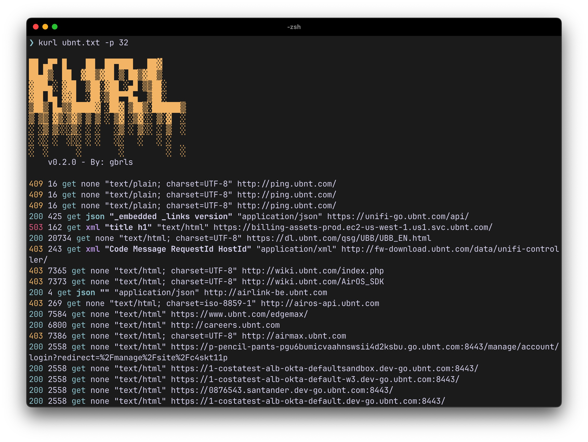

# Kurl
<p align="center">
<b>A Fast and Simple HTTP Client for Security Researchers</b>
</p>

<p align="center">
<a href="" align="center">Install</a>
•
<a href="" align="center">Usage</a>

</p>

<p align="center">



</p>


# Install Kurl

```bash
cargo install kurl
```
_For this to work you need to have [Rust installed](https://rustup.rs/)_

# Usage

```
kurl --help
```

Will show the command line usage.


```console
Simple CLI HTTP client focused on security research

Usage: kurl [OPTIONS] <URL_OR_FILE>

Arguments:
  <URL_OR_FILE>  URL or file with URLs to send the request

Options:
  -p <NWORKERS>
          Number of parallel threads to send the requests [default: 4]
  -X <VERB>
          [default: GET] [possible values: POST, GET, HEAD]
  -b, --body

  -d, --data <DATA>
          Data to be sent in the request body
      --verbosity-level <VERBOSITY_LEVEL>
          [default: 0]
  -o <OUTPUT>
          File to write the results
      --fext <FILTER_EXTENSIONS>
          Extensions to be ignored [default: jpeg,png,jpg,gif,wof,ttf,otf,eot,swf,ico,svg,css,woff,woff2]
      --fstatus <FILTER_STATUS>
          Status codes to be ignored [default: 404]
  -h, --help
          Print help
  -V, --version
          Print version
```
